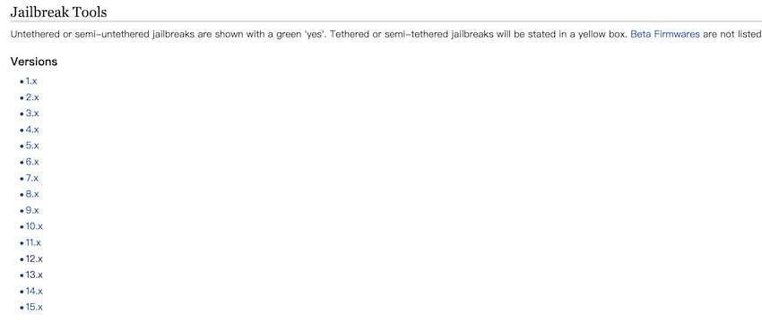

# 前言
> 摘自：[iOS Jailbreaking](https://en.wikipedia.org/wiki/IOS_jailbreaking)，[iOS越狱](https://zh.wikipedia.org/wiki/%E8%B6%8A%E7%8D%84_(iOS))

iOS越狱（iOS Jailbreaking）[权限提升](https://en.wikipedia.org/wiki/Privilege_escalation)的漏洞来移除制造商施加的软件限制。通常情况下，它是通过一系列的内核补丁完成的。越狱后的设备允许在操作系统内进行root访问，并且能安装AppStore之外的软件，不同的设备和版本有着不同的利用工具。

## 越狱种类
目前对越狱的完美程度，业界开发人员给出了四个类别：
- 不完美越狱（Tethered Jailbreak），指的是，当处于此状态的iOS设备开机重启后，之前进行的越狱程序就会失效，用户将失去Root权限，需要将设备连接电脑来使用（如特定版本下的红雪（redsn0w））等越狱软件进行引导开机以后，才可再次使用越狱程序。否则设备将无法正常引导。
- 完美越狱（Untethered Jailbreak），指设备在进行重启后，越狱状态仍被完整保留。
- 半不完美越狱（Semi-tethered Jailbreak），指设备在重启后，将丢失越狱状态，并恢复成未越狱状态。如果想要恢复越狱环境，必须连接计算机并在越狱工具的引导下启动来恢复越狱状态。
- 半完美越狱（Semi-untethered Jailbreak），指设备在重启后，将丢失越狱状态；而若想要再恢复越狱环境，只需在设备上进行某些操作即可恢复越狱。

## 用途

将iOS设备越狱的原因是为了突破苹果公司及其App Store的限制，其中最主要的原因是为了能安装那些未通过苹果公司审核的应用程序。

## 包管理器

包管理器或包管理系统是一组软件工具，可自动执行安装、升级、配置和删除计算机程序的过程。
对于越狱，这对于安装第三方内容至关重要，有一些专门针对越狱 iOS 设备的包管理器，其中最受欢迎的是[Cydia](http://cydia.saurik.com/)、[Sileo](https://getsileo.app/)、[Zebra](https://getzbra.com/) 和 `Installer 5`。

## 越狱工具

| 越狱工具                                 | 支持设备                                    | 其他                                                 |
|------------------------------------------|---------------------------------------------|------------------------------------------------------|
| [Chimera](https://chimera.coolstar.org/) | (iOS 12 — 12.5.5)所有设备                   | 12.0 - 12.1.2 支持的所有设备                         |
|                                          |                                             | 12.1.3 - 12.5.5 仅在 A7 - A11 设备上受支持           |
|                                          |                                             | 只有 Nonce setter 在 A12 上的 12.1.2 - 12.4.1 上可用 |
| [unc0ver](https://unc0ver.dev/)          | (iOS 11.0 到 14.3)所有设备                  | iOS 14.6-14.8 的 A12-A13 iPhone                      |
| [checkra1n](https://checkra.in/)         | iPhone 5s through iPhone X, iOS 12.0 and up | ...                                                  |

具体版本可以查看[theiphonewiki Jailbreak](https://www.theiphonewiki.com/wiki/Jailbreak)的详细表格**Jailbreak Tools**：

## 原理

TODO

## 参考链接

- [iOS Jailbreaking](https://en.wikipedia.org/wiki/IOS_jailbreaking)
- [iOS越狱](https://zh.wikipedia.org/wiki/%E8%B6%8A%E7%8D%84_(iOS))
- [Chimera](https://chimera.coolstar.org/)
- [unc0ver](https://unc0ver.dev/)   
- [checkra1n](https://checkra.in/)
- [theiphonewiki](https://www.theiphonewiki.com)