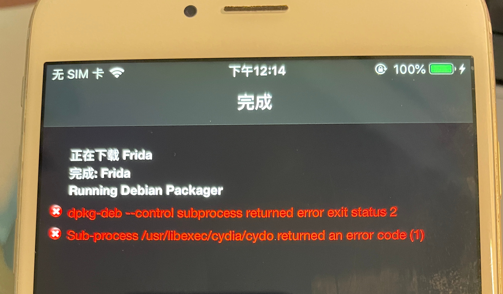
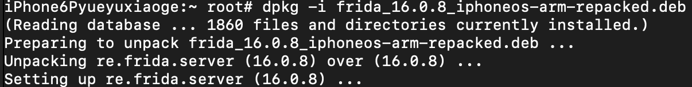
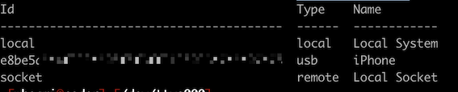
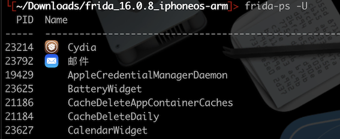

## Cydia工具安装

### frida

越狱设备中安装 [frida](https://frida.re/)，打开Cydia添加软件源：`https://build.frida.re` 并安装 `Frida-server`。

---

16.0.8安装失败错误日志：



`16.0.8` 存档是使用 zst 压缩的，iOS 上的 dpkg 不支持它，按照[https://github.com/frida/frida/issues/2355#issuecomment-1352811376](https://github.com/frida/frida/issues/2355#issuecomment-1352811376) 中用xz重新打包就能解决：

```bash
# 要使用 zst 上的 xz 压缩重新打包存档：
mkdir frida_16.0.8_iphoneos-arm
cd frida_16.0.8_iphoneos-arm
ar -x ../frida_16.0.8_iphoneos-arm.deb
zstd -d *.zst
xz *.tar
ar r frida_16.0.8_iphoneos-arm-repacked.deb debian-binary control.tar.xz data.tar.xz
# SCP frida_16.0.8_iphoneos-arm-repacked.deb 存档到你的设备，然后运行 dpkg -i：
dpkg -i frida_16.0.8_iphoneos-arm-repacked.deb
```

手动使用 dpkg 安装 frida-server 成功：


如果使用 `frida-tools` 时出现版本不匹配错误，例如：`Failed to enumerate processes: unable to communicate with remote frida-server; please ensure that major versions match and that the remote Frida has the feature you are trying to use`。

用命令 `pip3 install --upgrade frida && pip3 install --upgrade frida-tools` 更新 frida和frida-server保持最新即可。

---

macOS 运行`frida-ls-devices` 命令查看 通过 usb 连接的越狱设备：


macOS 运行`frida-ps -U` 命令查看设备上的进程：


---

### OpenSSH

### Darwin cc tools

## 参考链接

- [frida](https://frida.re/)
- [frida-issues-2355#issuecomment-1352811376](https://github.com/frida/frida/issues/2355#issuecomment-1352811376)