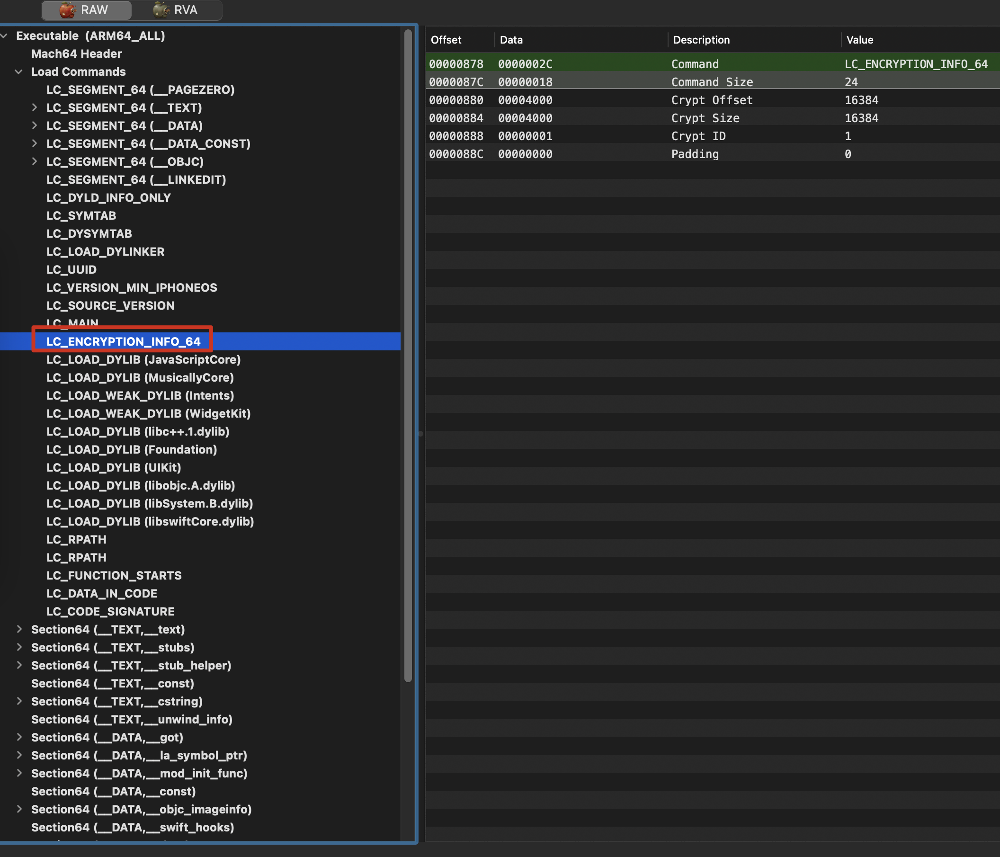
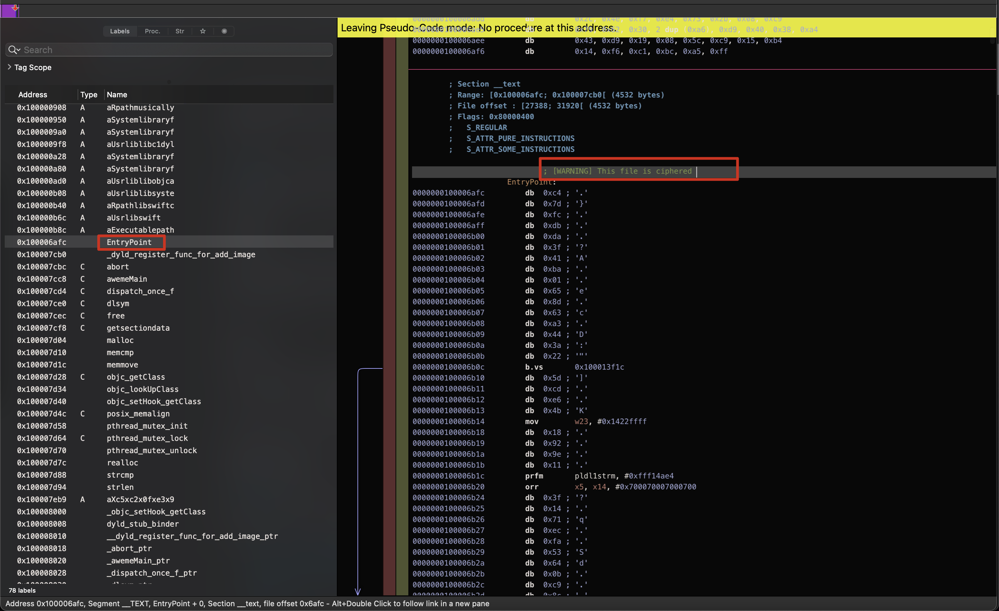
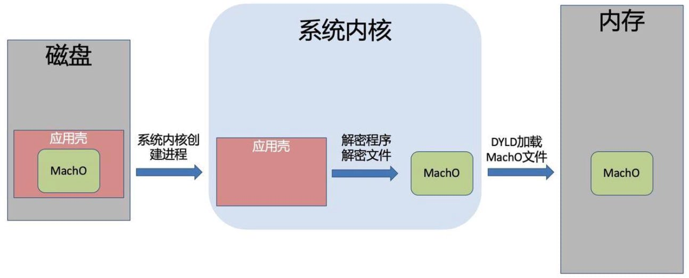
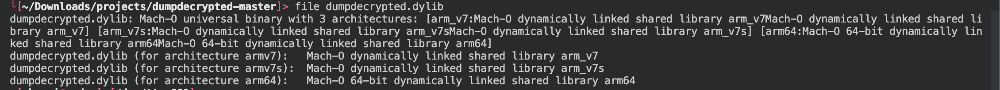
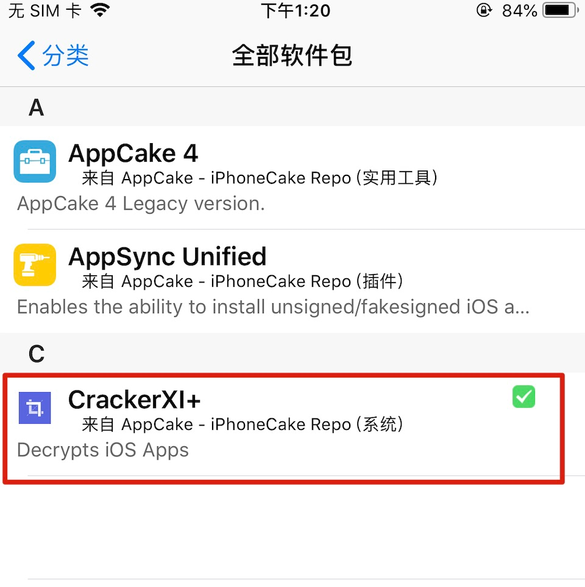
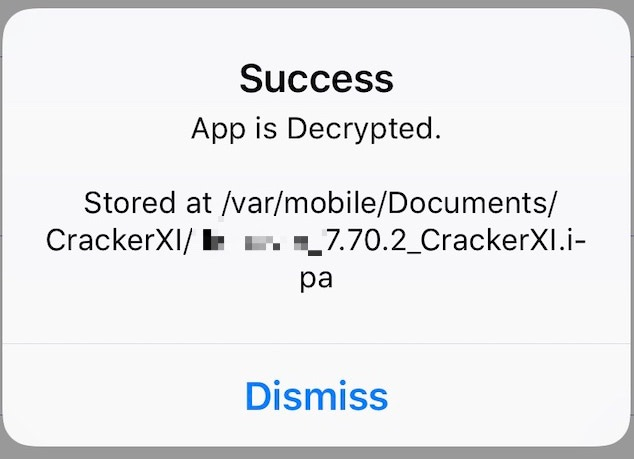

# 前言
> 砸壳原理小记：分析dumpdecrypted源码以及Clutch、frida-ios-dump、CrackerXI砸壳工具的使用。

用一句话总结网上文章对砸壳的解释：`AppStore` 发布的 App 都是加壳（[FairPlay DRM](https://tech.meituan.com/2021/11/25/fairplay-drm.html)）后的 `ipa` 文件，逆向App就得先砸壳，在iOS系统中，应用砸壳所使用的都是动态砸壳技术，即从运行在进程内存空间中的可执行程序映像（image）入手，将内存中的内容进行转储（dump）处理来实现脱壳处理。这种方法实现起来相对简单，且不必关心使用的是何种加密技术。

## 准备

1. [越狱](/docs/1-越狱)
2. Cydia工具安装
    - `OpenSSH`
    - `Darwin cc tools`
3. 下载App
    - 在 AppStore 随便找个App

`AppStore`下载的App在`/var/containers/Bundle/Application/$uuid` 目录下，找到刚才下载的App，通过查看`cryptid`标志位来判断App加密状态。其中1代表加密，0代表已解密：

```bash
$ otool -lv /var/containers/Bundle/Application/xxxxx-xxxx-xxxx-xxxx-xxxxx/Foo.app/Foo | egrep 'LC_ENCRYPTION_INFO|cryptid'
          cmd LC_ENCRYPTION_INFO_64
      cryptid 1
```

如果App没有被加密，则直接交给dyld加载并且运行。如果App已经被加密，则需要内核对其进行解密，得到解密后的MachO文件，再将其交给dyld加载并运行。

再把加密的 macho 用 MachOView 打开看到Load Commands 中有`LC_ENCRYPTION_INFO` 的`Crypt ID` 为 1 和上面otool命令查看的内容一致：



Hopper 打开找到入口，会提示这是个加密文件：



接下来就是对 App 进行砸壳，目前常见的砸壳工具如下：

- [dumpdecrypted](https://github.com/stefanesser/dumpdecrypted)
- [Clutch](https://github.com/KJCracks/Clutch)
- [frida-ios-dump](https://github.com/AloneMonkey/frida-ios-dump)
- CrackerXI+

## 初代砸壳工具

先从初代砸壳工具 [stefanesser - dumpdecrypted](https://github.com/stefanesser/dumpdecrypted) 的源码探究一下砸壳如何实现的。

### 源码分析

从运行命令 `$ DYLD_INSERT_LIBRARIES=dumpdecrypted.dylib /var/mobile/Applications/xxx-xxxx-xxxx/Scan.app/Scan` 看出这是利用注入动态库的方式，`__attribute__((constructor))` 是GCC 语法，当与函数一起使用时，会在程序启动时在**main()**函数之前执行该函数：

```c
__attribute__((constructor))
void dumptofile(int argc, const char **argv, const char **envp, const char **apple, struct ProgramVars *pvars)
```

这段代码不解的是：如何给 ProgramVars 结构体赋值的？（🤔️没找到什么资料，先跳过

---

在 [dumpdecrypted - conradev的fork版本](https://github.com/conradev/dumpdecrypted) 的源码中找到了答案：

`__attribute__((constructor)) static void dumpexecutable()` 中给`_dyld_register_func_for_add_image` 注册回调函数 `image_added` ：

```c
void dumptofile(const char *path, const struct mach_header *mh) {
	...
}

static void image_added(const struct mach_header *mh, intptr_t slide) {
	Dl_info image_info;
	int result = dladdr(mh, &image_info);
	dumptofile(image_info.dli_fname, mh);
}

__attribute__((constructor))
static void dumpexecutable() {
	_dyld_register_func_for_add_image(&image_added);
}
```

`_dyld_register_func_for_add_image` 的定义如下，简单来说当 dyld 加载或卸载程序映像（image）都会调用这个函数：

```c
/*
 * The following functions allow you to install callbacks which will be called   
 * by dyld whenever an image is loaded or unloaded.  During a call to _dyld_register_func_for_add_image()
 * the callback func is called for every existing image.  Later, it is called as each new image
 * is loaded and bound (but initializers not yet run).  The callback registered with
 * _dyld_register_func_for_remove_image() is called after any terminators in an image are run
 * and before the image is un-memory-mapped.
 */
extern void _dyld_register_func_for_add_image(void (*func)(const struct mach_header* mh, intptr_t vmaddr_slide))    __OSX_AVAILABLE_STARTING(__MAC_10_1, __IPHONE_2_0);
extern void _dyld_register_func_for_remove_image(void (*func)(const struct mach_header* mh, intptr_t vmaddr_slide)) __OSX_AVAILABLE_STARTING(__MAC_10_1, __IPHONE_2_0);
```

事已至此就来简单梳理内核加载加壳后的 MachO，大致的流程图如下：


1. 内核空间
    
    内核空间的主要任务是创建新 task 并初始化内存页和对应的权限：
    
    1. 分配虚拟内存空间。
    2. fork 进程。
    3. 加载 MachO 到进程空间。
    4. 加载动态链接器 dyld 并将控制权交给 dyld 处理。
2. 用户空间
    
    从内核回到用户空间，便跳转到目标的入口地址开始执行动态链接阶段，进入 dyld 动态链接器：
    
    1. 配置环境变量
    2. 加载共享缓存库
    3. 实例化主程序
    4. 加载动态链接库
    5. 链接主程序
    6. 加载Load和特定的C++的构造函数方法
    7. 寻找APP的main函数并调用

所以当有image被加载时都会调用`_dyld_register_func_for_add_image` 传入的回调函数。`dumptofile` 将MachO文件转储，把其函数内容步骤简化一下：

1、提取App文件名

```c
/* extract basename */
tmp = strrchr(rpath, '/');
printf("\n\n");
if (tmp == NULL)
{
	printf("[-] Unexpected error with filename.\n");
	_exit(1);
}
else
{
	printf("[+] Dumping %s\n", tmp + 1);
}
```

2、判断 `mach_header` 是64位还是32位，计算 `load commands` 指针

```c
/* detect if this is a arm64 binary */
if (mh->magic == MH_MAGIC_64)
{
	lc = (struct load_command *)((unsigned char *)mh + sizeof(struct mach_header_64));
	printf("[+] detected 64bit ARM binary in memory.\n");
}
else
{ /* we might want to check for other errors here, too */
	lc = (struct load_command *)((unsigned char *)mh + sizeof(struct mach_header));
	printf("[+] detected 32bit ARM binary in memory.\n");
}
```

3、判断 `LC_ENCRYPTION_INFO` 未加密就中断执行

```c
/* searching all load commands for an LC_ENCRYPTION_INFO load command */
for (i = 0; i < mh->ncmds; i++)
{
	/*printf("Load Command (%d): %08x\n", i, lc->cmd);*/
	if (lc->cmd == LC_ENCRYPTION_INFO || lc->cmd == LC_ENCRYPTION_INFO_64)
	{
		eic = (struct encryption_info_command *)lc;
		/* If this load command is present, but data is not crypted then exit */
		if (eic->cryptid == 0)
		{
			break;
		}
...
```

4、得到 `cryptid` 偏移量

```
off_cryptid = (off_t)((void *)&eic->cryptid - (void *)mh);
printf("[+] offset to cryptid found: @%p(from %p) = %x\n", &eic->cryptid, mh, off_cryptid);
```

5、读取原MachO header，判断 `FAT_CIGAM` 啥的重定位到真正的header地址：

```c
printf("[+] Reading header\n");
n = read(fd, (void *)buffer, sizeof(buffer));
if (n != sizeof(buffer))
{
	printf("[W] Warning read only %d bytes\n", n);
}

printf("[+] Detecting header type\n");
fh = (struct fat_header *)buffer;

/* Is this a FAT file - we assume the right endianess */
if (fh->magic == FAT_CIGAM)
{
	printf("[+] Executable is a FAT image - searching for right architecture\n");
	...
}
else if (fh->magic == MH_MAGIC || fh->magic == MH_MAGIC_64)
{
	printf("[+] Executable is a plain MACH-O image\n");
}
else
{
	printf("[-] Executable is of unknown type\n");
	_exit(1);
}
```

6、得到砸壳内容输出到文件

```c
...
/* calculate address of beginning of crypted data */
n = fileoffs + eic->cryptoff;

restsize = lseek(fd, 0, SEEK_END) - n - eic->cryptsize;
lseek(fd, 0, SEEK_SET);

printf("[+] Copying the not encrypted start of the file\n");
/* first copy all the data before the encrypted data */
while (n > 0)
{
	toread = (n > sizeof(buffer)) ? sizeof(buffer) : n;
	r = read(fd, buffer, toread);
	if (r != toread)
	{
		printf("[-] Error reading file\n");
		_exit(1);
	}
	n -= r;

	r = write(outfd, buffer, toread);
	if (r != toread)
	{
		printf("[-] Error writing file\n");
		_exit(1);
	}
}

/* now write the previously encrypted data */
printf("[+] Dumping the decrypted data into the file\n");
r = write(outfd, (unsigned char *)mh + eic->cryptoff, eic->cryptsize);
if (r != eic->cryptsize)
{
	printf("[-] Error writing file\n");
	_exit(1);
}

/* and finish with the remainder of the file */
n = restsize;
lseek(fd, eic->cryptsize, SEEK_CUR);
printf("[+] Copying the not encrypted remainder of the file\n");
while (n > 0)
{
	toread = (n > sizeof(buffer)) ? sizeof(buffer) : n;
	r = read(fd, buffer, toread);
	if (r != toread)
	{
		printf("[-] Error reading file\n");
		_exit(1);
	}
	n -= r;

	r = write(outfd, buffer, toread);
	if (r != toread)
	{
		printf("[-] Error writing file\n");
		_exit(1);
	}
}
...
```

主要分成三步：

- 复制文件头数据（header开始到eic->cryptoff
- 将解密数据写入文件（mh+eic->cryptoff 开始大小为 eic->cryptsize 的内核解密好的数据）
- 将文件的其余部分也写入文件

7、修改加密标识位

```
if (off_cryptid)
{
	uint32_t zero = 0;
	off_cryptid += fileoffs;
	printf("[+] Setting the LC_ENCRYPTION_INFO->cryptid to 0 at offset %x\n", off_cryptid);
	if (lseek(outfd, off_cryptid, SEEK_SET) != off_cryptid || write(outfd, &zero, 4) != 4)
	{
		printf("[-] Error writing cryptid value\n");
	}
}
```

到此砸壳过程就结束啦。

### 编译&测试

在项目根目录下执行`$ make` 生成`dumpdecrypted.dylib`：


拷贝到 iPhone 中，运行 `DYLD_INSERT_LIBRARIES=dumpdecrypted.dylib Foo.App/Foo` 出现 `missing LC_DYLD_INFO load command` 的错误，要将xcode iPhone sdk的版本与越狱机器的版本保持一致，我的测试机为 `iPhone 6 Plus` `iOS 12.5.5` 要下个 iOS12.* 的sdk，辣鸡 [xcode和sdk之间是绑定](https://stackoverflow.com/questions/34876144/where-to-download-an-slightly-older-ios-sdk/34876416#34876416)的，需要下载指定版本的xcode，再[把sdk添加到当前xcode](https://stackoverflow.com/a/13061104)就行了（😢一边下载一边测试下其他工具吧。

## Clutch

下载执行文件：[https://github.com/KJCracks/Clutch/releases](https://github.com/KJCracks/Clutch/releases) 拷贝到测试机中，运行 `Clutch -b xxx.xxx.xxx` 又报错啦：`Error: Failed to dump with arch arm64` 。好在翻到一条issue: [KJCracks/Clutch/issues/233](https://github.com/KJCracks/Clutch/issues/233) 给Clutch添加些权限就好了（在我的文章[macOS反反调试小记](https://blog.macoder.tech/article/macos-anti-anti-debug) 中也有记录操作步骤）：

```xml
<key>platform-application</key>
<true/>
<key>get-task-allow</key>
<true/>
<key>run-unsigned-code</key>
<true/>
<key>com.apple.private.skip-library-validation</key>
<true/>
<key>com.apple.private.security.no-container</key>
<true/>
```

ok！使用命令：`./Clutch -b [xxx.xxx.xxx Bundle ID]`  开始砸壳吧！

## frida-ios-dump

1. 安装[frida](/2-工具准备/2/#frida)
2. 克隆代码&安装依赖：

```bash
git clone https://github.com/AloneMonkey/frida-ios-dump
pip3 install -r frida-ios-dump/requirements.txt
```
3. 安装[usbmuxd](/2-工具准备/1/#_5)

ok！使用命令：`python3 dump.py [App Name]`  开始砸壳吧！

## CrackerXI+

1. 添加软件源&安装CrackerXI+

- Cydia软件源：`https://cydia.iphonecake.com/`
- 安装CrackerXI+



2. 砸壳

打开 `CrackerXI HOOK` 设置，选择 App 进行砸壳，步骤非常简单：



## 总结

这几个工具用来下，推荐 `CrackerXI`和`frida-ios-dump` 砸壳效果都还不错，`dumpdecrypted` 要匹配iOS版本下载对应的SDK编译麻烦，`Clutch` 砸壳效果不咋地。

先水到这，还有 `frida-ios-dump` 和 `clutch` 源码没研究，原理估计都差不多，读取内核解密后的内容并计算其偏移位置将其从内存中拷贝出来。

## 参考链接

- [Fairplay DRM与混淆实现的研究](https://tech.meituan.com/2021/11/25/fairplay-drm.html)
- [iOS-Pentest-Tools](https://trelis24.github.io/2018/03/11/iOS-Pentest-Tools/)
- [Understanding the iOS File System](https://medium.com/@lucideus/understanding-the-ios-file-system-eee3dc87e455)
- [一条命令完成砸壳](http://blog.alonemonkey.com/2018/01/30/frida-ios-dump/)
- [dumpdecrypted](https://github.com/stefanesser/dumpdecrypted)
- [__attribute__((constructor)) and __attribute__((destructor)) syntaxes in C](https://www.geeksforgeeks.org/__attribute__constructor-__attribute__destructor-syntaxes-c/)
- [深入浅出MachO](https://evilpan.com/2020/09/06/macho-inside-out/)
- [砸壳原理之dumpdecrypted](https://benarvintec.com/2019/06/20/iOS%E9%80%86%E5%90%91%E5%AD%A6%E4%B9%A0%EF%BC%88%E4%BA%8C%EF%BC%89%E7%A0%B8%E5%A3%B3%E5%8E%9F%E7%90%86%E4%B9%8Bdumpdecrypted/)
- [apple-oss-distributions/dyld](https://github.com/apple-oss-distributions/dyld)
- [iOS 应用的启动过程](http://www.samirchen.com/ios-app-launching/)
- [iOS逆向(5)-不知MachO怎敢说自己懂DYLD](https://juejin.cn/post/6844903798717022222)
- [iOS逆向(11)-砸壳原理剖析，主动加载所有framework](https://juejin.cn/post/6844904006024691726)
- [Frida-ios-dump一键砸壳菜鸡版](https://iosre.com/t/frida-ios-dump/11640)